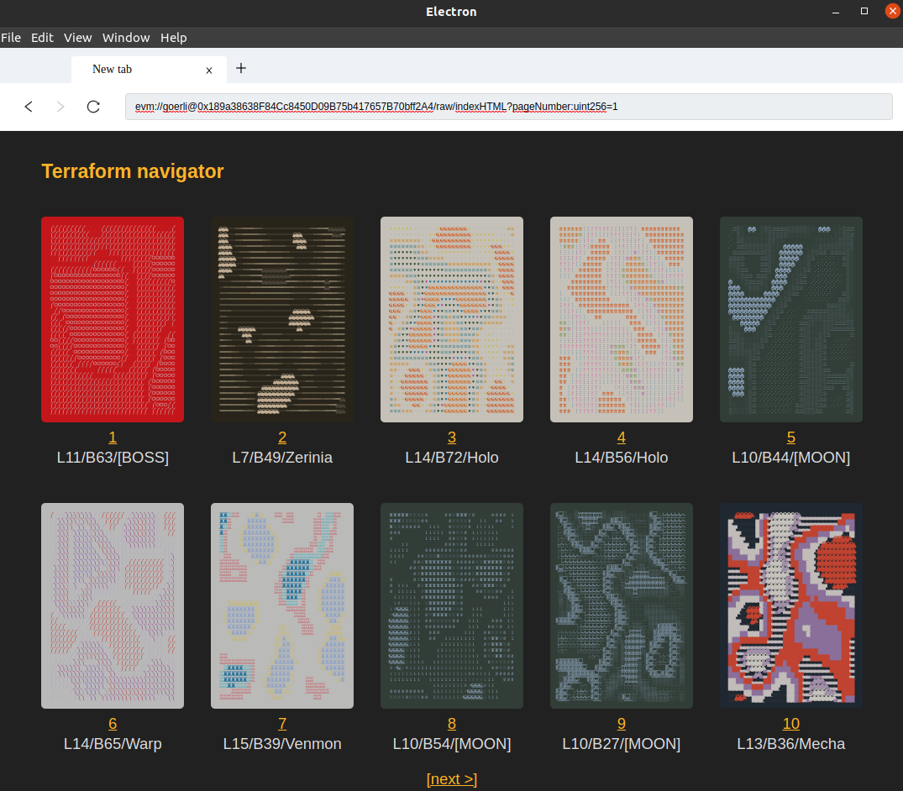
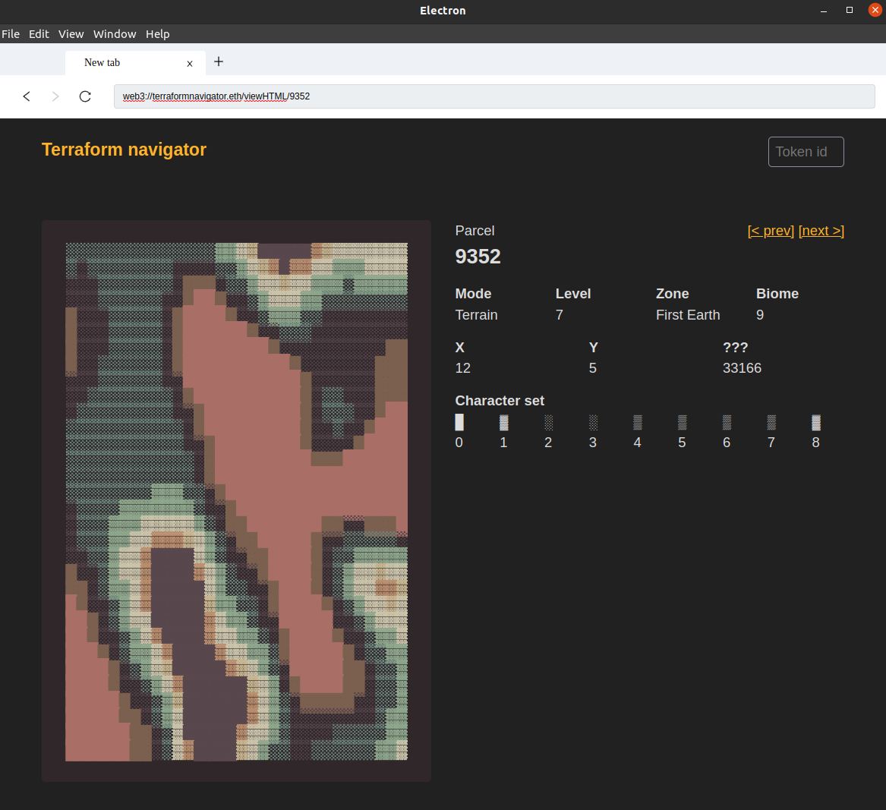

# EVM Browser

Browser with support of the [EIP-4804 `web3://` protocol](https://eips.ethereum.org/EIPS/eip-4804), which allow you to display the contents returned by EVM contracts from any EVM chain.
Browser forked from the great [electron-as-browser](https://github.com/hulufei/electron-as-browser) from hulufei. Experimental!

``web3://terraformnavigator.eth/``

will load an "on-chain website" served by a smart contract and interacting with Terraforms ([see contract on etherscan](https://etherscan.io/address/0x894ed8a11fed2cca743c78d807e75510b40eb701#code)). 

The browser works out of the box with all chains (providers are given by [viem.sh](https://viem.sh/) and [chainid.network](https://chainid.network/)) and support the [Frame.sh](https://frame.sh/) wallet.

ENS domain name resolution ([proposed EIP-6821](https://ethereum-magicians.org/t/eip-6821-support-ens-name-for-web3-url/13654)) happens via the declaration of a ``contentcontract`` TXT record containing a [EIP-3770 chain-specific address](https://eips.ethereum.org/EIPS/eip-3770), or, if not present, via a standard resolution.

Clicking on a terraform will load a dynamic page, for example : 

``web3://terraformnavigator.eth/viewHTML/9352``

More examples : 

``web3://0xA66556f4DB239E713491859258E577f25510eFd6:5/``

Load a goerli onchain website.

``web3://0x5a985f13345e820aa9618826b85f74c3986e1463:5/tokenHTML/2``

Load the HTML representation of the Terraform token 2 deployed in the goerli network.

``web3://0x5a985f13345e820aa9618826b85f74c3986e1463:5/tokenSVG/2.svg``

Load the SVG representation of the Terraform token 2 deployed in the goerli network.

``web3://0x76010876050387FA66E28a1883aD73d576D88Bf2:5/levelAndTile/2/50?returns=(uint256,uint256)``

Returns 2 numbers from this contract method, whose arguments are 2 and 50.

``web3://0x1f9840a85d5af5bf1d1762f925bdaddc4201f984/balanceOf/obok.eth?returns=(uint256)``

Returns the Uniswap token balance of obok.eth

## Wallet support

evm-browser also ships with [Frame.sh](https://frame.sh/) wallet and local node wallet support, which allows us to have a full read+write experience!

This is thanks to [eth-provider](https://github.com/floating/eth-provider), which is exposed on ``window.ethereum``

## Install

`yarn install`

## Usage

`yarn start`

By default it will use the ethereum providers embedded with the [viem.sh](https://viem.sh) library.

If you want to use your own web3 provider for mainnet : `yarn start --web3-chain 1=https://eth-mainnet.alchemyapi.io/v2/xxxxxx`

Use your local evm node for goerli : `yarn start --web3-chain 5=http://127.0.0.1:8545`

Add or override multiple chains : `yarn start --web3-chain 42170=https://nova.arbitrum.io/rpc --web3-chain 5=http://127.0.0.1:8545`

## evm:// protocol

Previously, a custom-made ``evm://`` protocol was made up. Keeping it here for a while, will dissapear soon.

Example : 

``evm://0xF311246e34cC59AdfaB6b9E486d18f67FB8C3e51.5/call/indexHTML(uint256)?arg=1``

will load a goerli proof-of-concept "on-chain website" served by a smart contract and interacting with Terraforms (see contract on [etherscan](https://goerli.etherscan.io/address/0xF311246e34cC59AdfaB6b9E486d18f67FB8C3e51#code))

Since `evm://` is supported at the browser level, alls links, fetch() calls will work.

## evm:// protocol

There will be 2 modes : a mode which work for all contracts, but end up with cumbersome URLs (the "low-level") mode, and a mode in which the contract implements an interface to allow more concise URLs.

### Low-level mode evm://

`evm://<contractAddress>[.<networkId>]/call/<contractMethod>(<argsType>)(<resultType>)<extension>?arg=<argValue>[&...]`

In this mode, all method arguments must be provided, in the right order. If the returned data is not HTML (e.g. SVG), it must be written as ``extension``. If the return data type is not a string, it must be specified with ``resultType``. If the method returns multiple variables, all return variables data type must be provided up to the one you want.

**Examples:**

`evm://0x5a985f13345e820aa9618826b85f74c3986e1463.5/call/tokenSVG(uint256).svg?arg=2`

Will call the tokenSVG method of the terraform contract located on goerli (chain id 5), ask for tokenId 2 and cast the result as image/svg+xml. This use unnamed parameters.

`evm://0x4e1f41613c9084fdb9e34e11fae9412427480e56/call/tokenHTML(uint256 tokenId)?tokenId=4197`

Will call the tokenHTML method of the terraform contract on mainnet, ask for tokenId 4197 and display its HTML. This use named parameters.

`evm://0xA5aFC9fE76a28fB12C60954Ed6e2e5f8ceF64Ff2/call/levelAndTile(uint256,uint256)(uint256,uint256).txt?arg=2&arg=50`

This call the levelAndTile method of the TerraformsData contract, which have 2 uint as arguments. This returns 2 uints, we display the second. And we display as text.

### "Standard" mode evm://

``evm://<contractAddress>[.<networkId>]/<path>?<arg1Name>=<argValue>[&...]``

Not implemented yet.
